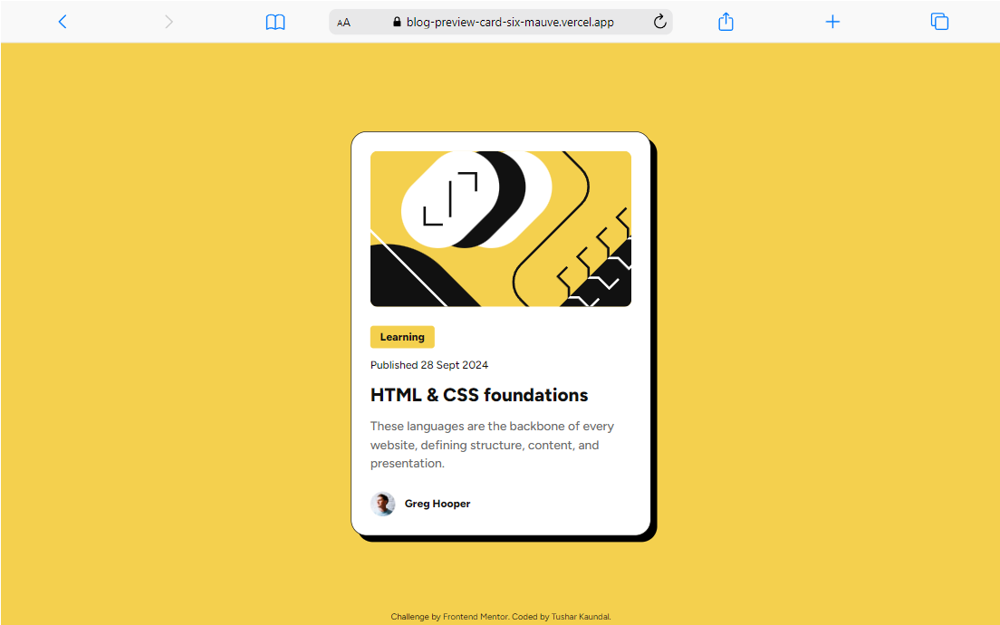
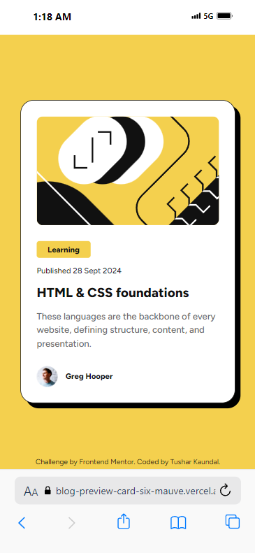

# Frontend Mentor - Blog preview card solution

This is a solution to the [Blog preview card challenge on Frontend Mentor](https://www.frontendmentor.io/challenges/blog-preview-card-ckPaj01IcS). Frontend Mentor challenges help you improve your coding skills by building realistic projects.

## Table of contents

- [Overview](#overview)
  - [The challenge](#the-challenge)
  - [Screenshot](#screenshot)
  - [Links](#links)
- [My process](#my-process)
  - [Built with](#built-with)
  - [What I learned](#what-i-learned)
- [Author](#author)

## Overview

### The challenge

Users should be able to:

- See hover and focus states for all interactive elements on the page

### Screenshot





### Links

- Solution URL: [Github](https://github.com/TusharKaundal/Blog-Preview-Card)
- Live Site URL: [Vercel](https://blog-preview-card-six-mauve.vercel.app/)

## My process

### Built with

- [x] Semantic HTML5 markup
- [x] CSS custom properties
- [x] Flexbox

### What I learned

Best part was that i learned about how to put transition for box-shadow using hover property

```css
.card {
  max-width: 24rem;
  background-color: var(--white);
  padding: 24px;
  border-radius: 20px;
  border: 1px solid var(--gray-950);
  box-shadow: 8px 8px #000000;
  transition: box-shadow 0.4s ease-in-out;
}

.card:hover {
  box-shadow: 16px 16px #000000;
  cursor: pointer;
}

.card:hover .text-preset-1 {
  color: var(--yellow);
}
```

## Author

- Website - [TusharKaundal](https://blog-preview-card-six-mauve.vercel.app/)
- Frontend Mentor - [@TusharKaundal](https://www.frontendmentor.io/profile/TusharKaundal)
